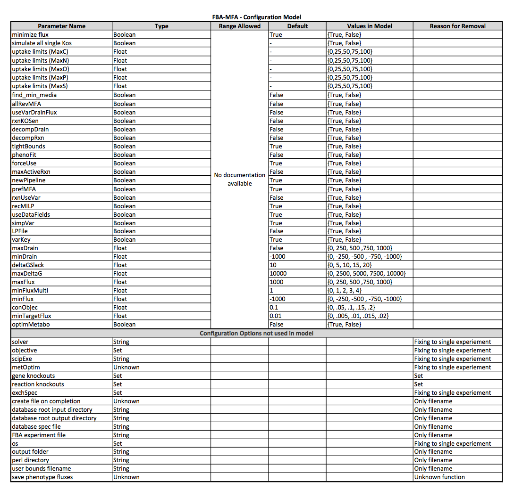
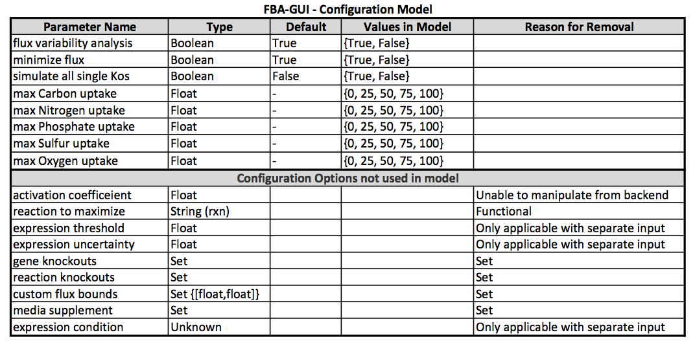
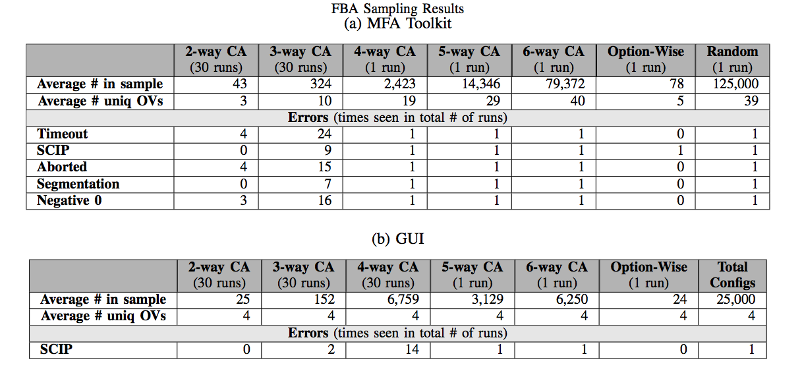

## FBA Subjects
We created two models for the FBA subject.  
The easiest way to use these tools is to install the KBase SDK [fba_tools module](https://github.com/cshenry/fba_tools).  The custom genomic model files are stored in ./test_local/workdir/fbafiles/tmp/ in the fba_tools SDK code.  We can not include all the model files as they generate a unique filepath, but they can be created with the media **CDG.media.tsv** and the genome is **Ecoli_genome.json**.  The configuration options we adjust are stored in the model file ./test_local/workdir/fbafiles/tmp/SpecializedParameters.txt.  We include the default example in the repo.

#### MFA Model
The first (MFA) includes advanced configuration options available from the [open source standalone version](https://github.com/cshenry/fba_tools/tree/master/MFAToolkit) of the FBA software in KBase.

#### GUI Model
The seconds (GUI) model includes a subset of the MFA configuration options that are available within the [GUI narrative online in KBase](https://narrative.kbase.us/#catalog/apps/fba_tools/run_flux_balance_analysis/release).

## Complete Configuration Models

## Sampling Results
We generated 30 covering arrays of strength 2 and 30 covering arrays of strength 3 using CASA.  We also used ACTS to generate higher strength covering arrays of strengths 4, 5 and 6.  In ACTS the resulting CAs are deterministic so we have 1 run of each strength.

**MFA:**     In sampling for the functional output we see that a 2-way CA only achieves 3 unique objective values compared to the 39 we saw in our large (125,000) sample.  We don't see at least half these unique OVs until we scale up to a 5-way CA.  Similarly, if we analyze the samples for errors we don't consistently see all 5 errors until the 4-way CA.  This tells us that these scientific software systems have higher order interactions than traditional software systems where we tend to see interactions at low levels (2 or 3).  The Option-Wise testing method only captured 5 unique OVs and only 1 of the errors.

**GUI:**     We see the total number of unique OV values (4) in all the samples showing the CAs can sample the GUI functionality.  The SCIP error however doesn't show up consistently (in at least half the runs) until the 5-way CA showing we need a higher strength to effectively sample the performance variability.

